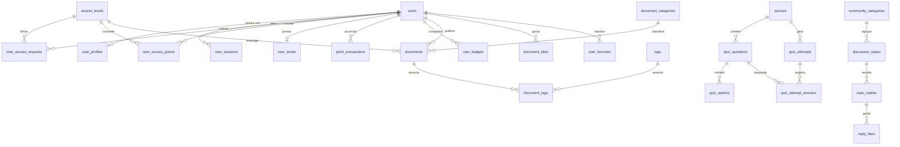

# Base de Dados e Modelo Físico

Este documento fornece a especificação completa da base de dados relacional para o portal **Economia Com História**. A base de dados foi concebida para suportar integridade referencial estrita e rapidez de leitura através de índices adequados.

---

## 1. Diagrama de Entidades e Relacionamentos (ER)

---

## 2. Dicionário de Tabelas Principais

### 2.1 Tabela `users`
Guarda as credenciais e status de segurança dos utilizadores.
* **PK**: `id` (UUID, char 36)
* **Campos**:
  * `email` (varchar 255, UNIQUE)
  * `password_hash` (varchar 255)
  * `email_verified` (boolean, default false)
  * `is_active` (boolean, default true)
  * `role` (enum: 'estudante', 'investigador', 'professor', 'admin')
  * `last_login_at` (datetime, nullable)
* **Índices**: `email` (Unique)

### 2.2 Tabela `user_profiles`
Informações acessórias do perfil do utilizador.
* **PK**: `id` (UUID)
* **FK**: `user_id` -> `users(id)` ON DELETE CASCADE
* **Campos**:
  * `display_name` (varchar 100)
  * `full_name` (varchar 255, nullable)
  * `biography` (text, nullable)
  * `institution` (varchar 255, nullable)
  * `province` (varchar 100, nullable)
  * `avatar_url` (varchar 500, nullable)

### 2.3 Tabela `access_levels`
Níveis de acesso para classificação de conteúdos.
* **PK**: `id` (varchar 20) (ex: 'public', 'restricted', 'jindungo')
* **Campos**:
  * `name` (varchar 100)
  * `description` (text, nullable)
  * `requires_approval` (boolean)
  * `auto_grant` (boolean)

### 2.4 Tabela `user_access_grants`
Concessões de acesso ativas ou passadas do utilizador.
* **PK**: `id` (UUID)
* **FKs**:
  * `user_id` -> `users(id)` ON DELETE CASCADE
  * `access_level_id` -> `access_levels(id)`
  * `granted_by` -> `users(id)` (nullable)
  * `request_id` -> `user_access_requests(id)` (nullable)
* **Campos**:
  * `granted_at` (datetime)
  * `expires_at` (datetime, nullable)
  * `revoked_at` (datetime, nullable)
  * `is_active` (boolean, default true)
* **Índices**: Unique `uq_access_grants` (`user_id`, `access_level_id`)

### 2.5 Tabela `user_levels`
Resumo dos pontos de gamificação e conquistas acumuladas pelo utilizador.
* **PK**: `id` (UUID)
* **FK**:
  * `user_id` -> `users(id)` ON DELETE CASCADE
  * `current_level` -> `level_definitions(level)`
* **Campos**:
  * `total_points` (integer, default 0)
  * `weekly_points` (integer, default 0)
  * `monthly_points` (integer, default 0)
  * `quizzes_completed` (integer)
  * `documents_read` (integer)
  * `topics_created` (integer)
  * `replies_posted` (integer)

### 2.6 Tabela `documents`
Guarda os metadados dos recursos bibliográficos e arquivísticos.
* **PK**: `id` (UUID)
* **FKs**:
  * `category_id` -> `document_categories(id)` (nullable)
  * `access_level_id` -> `access_levels(id)`
  * `created_by` -> `users(id)`
  * `reviewed_by` -> `users(id)` (nullable)
* **Campos**:
  * `title` (varchar 500)
  * `slug` (varchar 500, UNIQUE)
  * `author` (varchar 255)
  * `document_type` (enum: 'manuscript', 'article', 'report', 'thesis', 'archive')
  * `academic_level` (enum: 'intro', 'advanced', 'doctorate')
  * `pdf_url` (varchar 500, nullable)
  * `status` (enum: 'draft', 'published', 'archived', 'flagged')
* **Índices**: FullText index `ft_documents_search` (`title`, `summary`)

---

## 3. Triggers e Integridade por Base de Dados (MySQL)

1. **`trg_access_grants_before_insert`**:
   Ativa automaticamente a flag `is_active = 0` na inserção de uma concessão se esta já possuir data de revogação ou validade expirada.
2. **`trg_access_grants_before_update`**:
   Atualiza a flag `is_active` em atualizações subsequentes caso a concessão seja expirada ou revogada.
3. **Eventos Agendados**:
   O evento `evt_refresh_leaderboard` corre a cada 10 minutos para chamar a Stored Procedure `sp_refresh_leaderboard_nacional`, preenchendo a tabela cache `leaderboard_nacional_cache` de forma a poupar a carga nas tabelas de escrita direta.
