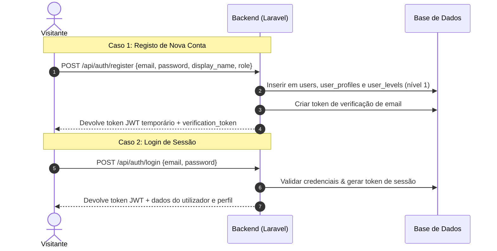
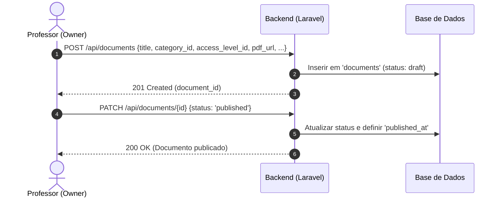
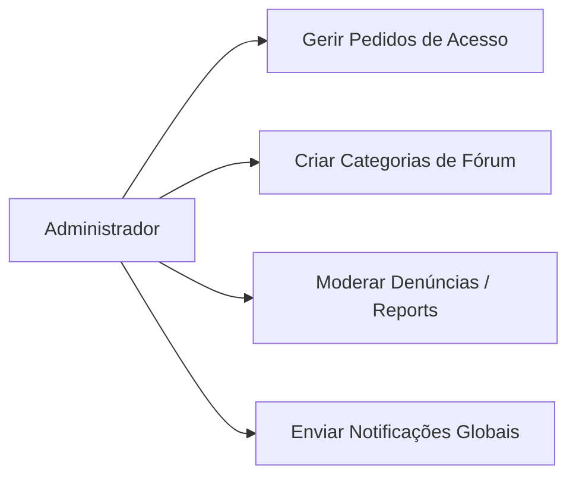
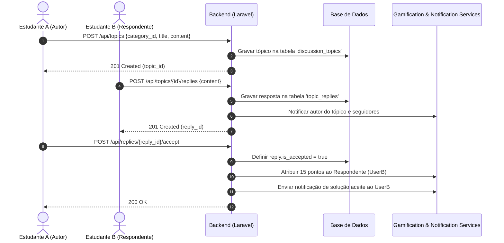
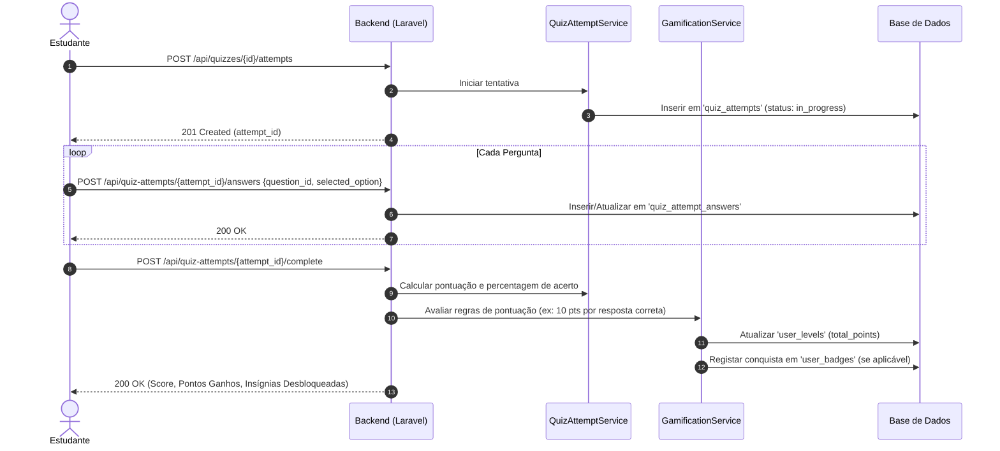
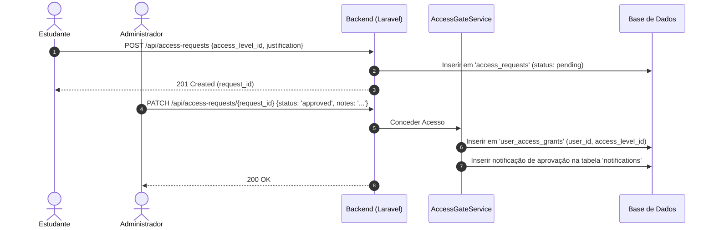

# Fluxos Funcionais do Sistema

Este documento descreve as principais jornadas de utilizador e fluxos transacionais do backend do portal **Economia Com História**. Cada fluxo é ilustrado com diagramas Mermaid para facilitar a integração dos frontends (Angular e React Native).

---

## 1. Fluxos de Perfis (User Roles)

### 1.1 Utilizador Não Logado (Visitante)
O visitante tem acesso apenas a rotas públicas. O seu objetivo é conhecer o portal, registar-se ou recuperar credenciais se necessário.



---

### 1.2 Estudante
O estudante consome conteúdos (documentos, quizzes) e participa na comunidade. O seu acesso a documentos restritos depende do seu nível ou de concessões explícitas.

```mermaid
flowchart TD
    A[Estudante Autenticado] --> B{Ações Disponíveis}
    B --> C[Consultar Documentos]
    B --> D[Responder a Quizzes]
    B --> E[Participar no Fórum]
    B --> F[Pedir Nível de Acesso]

    C --> C1[GET /api/documents]
    C1 --> C2{Nível do Doc?}
    C2 -- Público/Autorizado --> C3[Ver PDF e Gostar]
    C2 -- Restrito --> C4[Bloqueado: Solicitar Acesso]

    D --> D1[POST /api/quizzes/{id}/attempts]
    D1 --> D2[POST /api/quiz-attempts/{id}/answers]
    D2 --> D3[POST /api/quiz-attempts/{id}/complete]
    D3 --> D4[Ganhar Pontos e Subir Nível]
```

---

### 1.3 Professor
O professor gere o conhecimento. Cria, edita e remove documentos e quizzes no portal, além de interagir como utilizador.



---

### 1.4 Administrador
O administrador controla as permissões, modera a comunidade, audita as denúncias e envia notificações globais.



---

## 2. Fluxos Transacionais por Funcionalidade

### 2.1 Comunidade (Fórum)
Fluxo de criação de debate, resposta, solução aceite e distribuição de méritos.



---

### 2.2 Quizzes (Resolução e Gamificação)
Como o estudante resolve testes de conhecimento e o motor do backend calcula pontos.



---

### 2.3 Controlo de Acesso (Solicitação e Concessão)
Processo pelo qual um utilizador ganha direitos a documentos restritos e é notificado.


