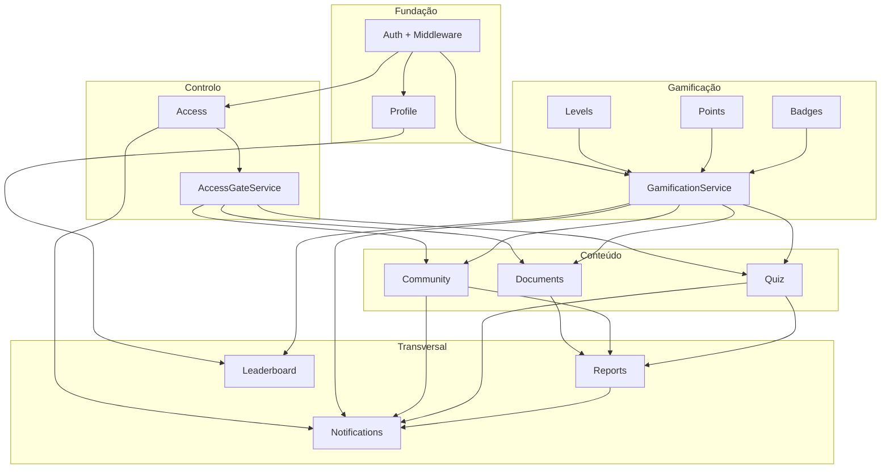

# Plano técnico — ordem ótima para concluir a API

**Data:** 4 de junho de 2026  
**Âmbito:** backend Laravel (`backend/`)  
**Referência:** `docs/AUDITORIA-API-LARAVEL.md`

**Princípio:** fechar fundação → desbloquear conteúdo protegido → motor de pontos → fluxos que geram pontos → transversal (notificações) → moderação → ranking.

**Estado atual (resumo):** Sprints 1–3 entregues no backend — Auth/Profile, Access+AccessGate+Documents (gate), `GamificationService`+fluxo quiz (`answer`/`complete`); Community, Reports e CRUD admin de quiz ainda 501; Notifications e Leaderboard sem integração com gamificação. Ver [`docs/sprints/`](sprints/).

---

## Grafo de dependências

---

## Análise por módulo

### Auth

| Tipo | Detalhe |
|------|---------|
| **Dependências técnicas** | `users`, `user_sessions`, `verification_tokens`; `AuthenticateApiSession`; model `User` |
| **Dependências de negócio** | Nenhuma (raiz da API) |
| **Serviços partilhados** | Emite sessão usada por todos os endpoints protegidos |
| **Tabelas partilhadas** | `users` (FK em ~30 tabelas); cria `user_levels` no registo |
| **Fluxos dependentes** | `GET /me` alimenta Profile, Access grants, Levels, Badges |

**Lacunas:** e-mail de verificação; alinhar `email_verification` vs `email_verify` (SQL); gestão de sessões; restringir `role: admin` no registo.

---

### Profile

| Tipo | Detalhe |
|------|---------|
| **Dependências técnicas** | Auth (`user_id`); storage público (avatar) |
| **Dependências de negócio** | Utilizador autenticado |
| **Serviços partilhados** | — |
| **Tabelas partilhadas** | `user_profiles` → Leaderboard (`province`, `display_name`, `avatar_url`) |
| **Fluxos** | Alteração de password revoga `user_sessions` (cruzamento com Auth) |

**Lacunas:** desativação de conta (`is_active`); CRUD admin de utilizadores (painel admin).

---

### Access

| Tipo | Detalhe |
|------|---------|
| **Dependências técnicas** | Auth; `EnsureRole` para review/revoke |
| **Dependências de negócio** | Pedido → aprovação admin → grant activo |
| **Serviços partilhados** | **`AccessGateService`** → Documents, Quiz, Community |
| **Tabelas partilhadas** | `access_levels` em `documents`, `quizzes`, `community_categories` |
| **Fluxos** | Aprovação → notificação `access_granted` / `access_rejected` |

**Lacunas:** listagem admin de pedidos; ownership em `showRequest`; integração Notifications.

---

### Documents

| Tipo | Detalhe |
|------|---------|
| **Dependências técnicas** | Auth; joins `access_levels`, `user_profiles` |
| **Dependências de negócio** | `access_level_id` exige grant (regra BD, não aplicada na API) |
| **Serviços partilhados** | `AccessGateService`; opcional `GamificationService` (`document_liked`) |
| **Tabelas partilhadas** | `access_levels`, `users`/`user_profiles`, `tags`, interacções |
| **Fluxos** | Download/like → pontos → Leaderboard; Reports sobre `document` |

**Estado:** ~85% (CRUD + interações). Falta gate, `document_categories`, favoritos listagem.

---

### Quiz

| Tipo | Detalhe |
|------|---------|
| **Dependências técnicas** | `quizzes` → `quiz_questions` → `quiz_options` → `quiz_attempts` → `quiz_attempt_answers` |
| **Dependências de negócio** | Conclusão atribui pontos, contadores, badges, notificações |
| **Serviços partilhados** | `AccessGateService`; `QuizAttemptService`; **`GamificationService`** |
| **Tabelas partilhadas** | `access_levels`, `user_levels`, `point_transactions`, `user_badges`, `notifications` |
| **Fluxos** | `completeAttempt` → Points → Levels → Badges → Notifications → Leaderboard |

**Estado:** leitura + `startAttempt` OK; `answerAttempt` / `completeAttempt` / CRUD em **501**.

---

### Community

| Tipo | Detalhe |
|------|---------|
| **Dependências técnicas** | Auth; `community_categories.access_level_id` |
| **Dependências de negócio** | Tópico/resposta → pontos; likes/follow; resposta aceite |
| **Serviços partilhados** | `AccessGateService`; `CommunityInteractionService`; `GamificationService`; `NotificationService` |
| **Tabelas partilhadas** | `users`, `access_levels`, `user_levels`, contadores em topics/replies |
| **Fluxos** | Reply em tópico seguido → notificação; Reports sobre `topic`/`reply` |

**Estado:** só leitura; **14 endpoints 501**.

---

### Reports

| Tipo | Detalhe |
|------|---------|
| **Dependências técnicas** | Auth; `EnsureRole` admin |
| **Dependências de negócio** | Conteúdo reportável (Documents, Community, User) |
| **Serviços partilhados** | **`ReportModerationService`** |
| **Tabelas partilhadas** | `content_reports` (polimórfico) |
| **Fluxos** | `action` pode marcar `flagged` em tópico/documento |

**Estado:** listagem própria OK; `store` / `update` / `action` em **501**. Implementar **depois** do conteúdo.

---

### Notifications

| Tipo | Detalhe |
|------|---------|
| **Dependências técnicas** | Auth; Mail/Resend; model `User` |
| **Dependências de negócio** | Eventos de Access, Quiz, Community, Gamification |
| **Serviços partilhados** | **`NotificationService`** (tipos CHECK, ownership) |
| **Tabelas partilhadas** | `notifications` (`reference_id`, `reference_type`) |
| **Fluxos** | Consumidor final; não bloqueia leitura de conteúdo |

**Estado:** ~75%. Reforçar contrato cedo; ligar eventos nos sprints de domínio.

---

### Leaderboard

| Tipo | Detalhe |
|------|---------|
| **Dependências técnicas** | VIEW `province_stats`; `leaderboard_nacional_cache`; procedure `sp_refresh_leaderboard_nacional` |
| **Dependências de negócio** | Reflecte `user_levels.total_points` e `user_profiles.province` |
| **Serviços partilhados** | **`LeaderboardRefreshService`** / comando Artisan |
| **Tabelas partilhadas** | `user_levels`, `user_profiles`, `leaderboard_snapshots` |
| **Fluxos** | Só fiável após Gamification actualizar pontos |

**Estado:** nacional/stats OK; provincial **501**; cache pode estar vazio.

---

### Levels

| Tipo | Detalhe |
|------|---------|
| **Dependências técnicas** | `level_definitions` (seed); `user_levels` no registo (Auth) |
| **Dependências de negócio** | `current_level` vs `min_points` / `max_points` |
| **Serviços partilhados** | Parte de **`GamificationService`** (não sprint isolado) |
| **Tabelas partilhadas** | `user_levels` em `/me`, Leaderboard, critérios de badges |
| **Fluxos** | `level_up` → notificação |

**Estado:** só leitura via `/me`. Implementar **com** Points e Badges (Sprint 3).

---

### Points

| Tipo | Detalhe |
|------|---------|
| **Dependências técnicas** | `point_transactions` (reason CHECK); `user_levels` |
| **Dependências de negócio** | Razões: `quiz_completion`, `topic_created`, `document_liked`, etc. |
| **Serviços partilhados** | **`GamificationService::awardPoints()`** |
| **Tabelas partilhadas** | `point_transactions`, `user_levels` |
| **Fluxos** | Toda acção gamificada passa aqui antes de Badges e Leaderboard |

**Estado:** tabela sem API. **Núcleo** — antes de Quiz (complete) e Community (write).

---

### Badges

| Tipo | Detalhe |
|------|---------|
| **Dependências técnicas** | `badges` (seed + `criteria_value` JSON); `user_badges` |
| **Dependências de negócio** | Avaliar critérios após contadores/pontos |
| **Serviços partilhados** | **`GamificationService::evaluateBadges()`** |
| **Tabelas partilhadas** | `user_badges`; leitura em `/me` |
| **Fluxos** | Novo badge → `badge_earned` |

**Estado:** seed + `/me`; sem concessão automática. **Mesmo sprint que Points/Levels.**

---

## Serviços partilhados (ordem de criação)

| Ordem | Serviço | Consumidores |
|-------|---------|--------------|
| 1 | `AccessGateService` | Documents, Quiz, Community |
| 2 | `GamificationService` | Quiz, Documents (opc.), Community, Levels, Points, Badges |
| 3 | `NotificationService` | Access, Gamification, Community, Quiz, Reports |
| 4 | `QuizAttemptService` | Quiz |
| 5 | `CommunityInteractionService` | Community |
| 6 | `LeaderboardRefreshService` | Leaderboard |
| 7 | `ReportModerationService` | Reports |

---

## Tabelas hub

| Tabela | Quem escreve | Quem lê |
|--------|--------------|---------|
| `users` | Auth | Todos |
| `user_profiles` | Profile, Auth | Documents, Leaderboard, `/me` |
| `access_levels` | Migration/seed | Access, Documents, Quiz, Community |
| `user_access_grants` | Access | AccessGate → conteúdo |
| `user_levels` | Auth (init), Gamification | `/me`, Leaderboard |
| `level_definitions` | Seed | Gamification, `/me` |
| `point_transactions` | Gamification | Auditoria |
| `badges` / `user_badges` | Gamification | `/me` |
| `notifications` | NotificationService | Notifications |

---

## Fluxos críticos entre módulos

1. **Registo** — Auth → Profile + `user_levels`.
2. **Pedido de acesso** — Access → grant → AccessGate libera conteúdo.
3. **Concluir quiz** — Quiz → Gamification → Levels → Badges → Notifications → Leaderboard.
4. **Tópico/resposta** — Community → Gamification → Notifications.
5. **Denúncia** — Reports → admin `action` → status em Community/Documents.
6. **Ranking** — Leaderboard após `user_levels` actualizado.

---

## Ordem ótima de implementação

### Sprint 1 — Fundação e contratos transversais

**Módulos:** Auth (fechar), Profile (fechar), infra partilhada

**Entregas:**

- Auth: e-mail de verificação; alinhar tipos de token; sessões; hardening registo (`role`)
- Profile: lacunas menores; `province` consistente para Leaderboard
- Esqueleto: `AccessGateService`, `GamificationService`, `NotificationService` + testes mínimos
- FormRequests / padrão JSON (opcional)

**Porquê primeiro:** sem Auth/Profile estáveis e serviços definidos, cada sprint duplica lógica nos controladores.

**Não incluir:** Quiz complete, Community write, Reports.

---

### Sprint 2 — Access completo + AccessGate

**Módulos:** Access (fechar), primeiro uso em Documents

**Entregas:**

- `GET /access-requests` para admin (todos ou `?status=pending`)
- Ownership em `showRequest` / `reviewRequest`
- `AccessGateService::canAccess(user, access_level_id)` + testes
- Gate em `DocumentController::show` e `download`
- `GET /document-categories` (se MVP exigir)

**Porquê antes de Quiz/Community:** `access_level_id` em documentos, quizzes e categorias de fórum.

**Depende de:** Sprint 1.

---

### Sprint 3 — Gamificação núcleo (Levels + Points + Badges)

**Módulos:** Levels, Points, Badges (um bloco)

**Entregas:**

- `GamificationService`: `awardPoints()`, `updateCounters()`, `resolveLevel()`, `evaluateBadges()`
- Transacções em `point_transactions` + `user_levels`
- Notificações `level_up`, `badge_earned`
- Testes com razões CHECK da BD
- Validar payloads em `/me`

**Porquê antes de Quiz/Community:** `completeAttempt` e posts no fórum precisam deste motor.

**Depende de:** Sprint 1 (`user_levels` no registo).

---

### Sprint 4 — Documents (fechar MVP)

**Módulos:** Documents

**Entregas:**

- AccessGate em listagem/search (filtrar ou 403)
- `GET /document-categories`; `GET /me/favorites` (se MVP)
- Pontos opcionais: `document_liked`
- Testes Feature

**Porquê agora:** módulo ~85%; gate + categorias desbloqueiam acervo com regras correctas.

**Depende de:** Sprint 2, Sprint 3 (pontos opcionais).

---

### Sprint 5 — Quiz (fluxo completo)

**Módulos:** Quiz

**Entregas:**

- `questions()` com `quiz_options` (sem `is_correct` prematuro)
- `QuizAttemptService`: `answerAttempt`, `completeAttempt`
- CRUD admin/professor se MVP incluir gestão
- Gamification + AccessGate + `quiz_completed`
- Testes E2E de tentativa

**Porquê após Gamification:** maior fluxo de dependências (points, badges, `quizzes_completed`).

**Depende de:** Sprint 2, 3, 1 (notificações).

---

### Sprint 6 — Community (escrita e interações)

**Módulos:** Community

**Entregas:**

- Implementar 14 métodos 501
- `CommunityInteractionService` + contadores
- AccessGate em categorias / criação de tópico
- Gamification: `topic_created`, `reply_posted`, likes
- Notificações: `topic_reply`, `topic_like`, `reply_like`, `mention`
- `storeCategory` (admin)

**Porquê depois de Quiz:** reutiliza padrões de Gamification e Notifications.

**Depende de:** Sprint 2, 3, 1.

**Antes de:** Reports (conteúdo reportável).

---

### Sprint 7 — Notifications (consolidação)

**Módulos:** Notifications (fechar)

**Entregas:**

- Tipos alinhados ao CHECK SQL
- Ownership em `markRead` / `destroy`
- Catálogo de eventos dos sprints 2–6
- Testes por tipo

**Porquê sprint dedicado:** inbox já funciona; evita débito técnico nos eventos emitidos incrementalmente.

**Nota:** ligar eventos já nos sprints 3–6; Sprint 7 uniformiza.

---

### Sprint 8 — Reports (moderação)

**Módulos:** Reports

**Entregas:**

- `store`, `update`, `action` + `ReportModerationService`
- Listagem admin (`pending`)
- Validação `content_type` / `content_id`
- Acções `flagged` em tópico/documento

**Porquê tarde:** precisa de conteúdo e roles admin.

**Depende de:** Sprint 4, 6, 1, 7.

---

### Sprint 9 — Leaderboard (fechar)

**Módulos:** Leaderboard

**Entregas:**

- Comando `leaderboard:refresh` (procedure SQL)
- Popular cache pós-seed / deploy
- `provincial` por `user_profiles.province`
- Snapshots diários (opcional MVP)
- Testes após pontos de Quiz/Community

**Porquê quase no fim:** ranking sem `user_levels` actualizado é enganador.

**Depende de:** Sprint 3, 5, 6, 1.

---

### Sprint 10 — Hardening e API MVP fechada

**Módulos:** transversal

**Entregas:**

- Testes Feature por módulo; zero 501 residual
- Documentação API alinhada
- Rate limiting; ownership global
- Admin users (se MVP exigir)
- Performance (índices, listagens)

---

## Resumo sequencial

| Sprint | Foco | Módulo(s) | Motivo |
|--------|------|-----------|--------|
| 1 | Fundação | Auth, Profile, serviços base | Raiz técnica |
| 2 | Gate | Access + AccessGate | Conteúdo protegido |
| 3 | Motor | Levels, Points, Badges | Quiz e Community escrevem aqui |
| 4 | Conteúdo A | Documents | Maduro; aplica gate |
| 5 | Conteúdo B | Quiz | Fluxo gamificado completo |
| 6 | Conteúdo C | Community | 14× 501 |
| 7 | Transversal | Notifications | Unifica eventos |
| 8 | Moderação | Reports | Precisa de conteúdo |
| 9 | Agregação | Leaderboard | Precisa de pontos |
| 10 | Qualidade | Todos | Testes, docs, segurança |

---

## O que não inverter

| Implementar | Antes de | Risco |
|-------------|----------|--------|
| Quiz `completeAttempt` | GamificationService | Lógica duplicada no controller |
| Community write | AccessGate | Tópicos em categorias restritas |
| Leaderboard refresh | Quiz/Community a atribuir pontos | Ranking vazio |
| Reports `action` | Community/Documents estáveis | Moderação sem alvo |
| Badges automáticos | Points + `user_levels` | Critérios nunca satisfeitos |

---

## Paralelização (equipa > 1 dev)

- Sprint 4 e 5 em paralelo **após Sprint 3**, se Quiz só avançar leitura até Gamification pronto.
- Notifications: ligar eventos **incrementalmente** nos sprints 2–6; Sprint 7 consolida.
- Leaderboard: iniciar comando `refresh` no Sprint 3; expor **provincial** no Sprint 9.

---

## Estimativa

| Sprints | Dias (1 dev) |
|---------|----------------|
| 1–3 | 4–6 |
| 4–6 | 5–8 |
| 7–9 | 3–5 |
| 10 | 1–2 |
| **Total** | **~13–21 dias** |

---

*Documento de planeamento. Não substitui requisitos formais em `docs/requisitos/` quando estiverem preenchidos.*
