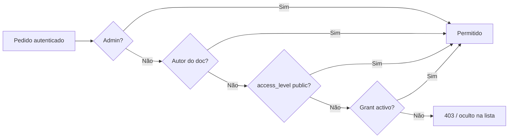

# API — Documentos

**Versão:** 1.0.0 (Sprint 2)  
**Base URL:** `http://127.0.0.1:8000/api`  
**Autenticação:** Bearer Token (obrigatória em todos os endpoints abaixo)

---

## Visão geral

Os documentos têm um `access_level_id` (`public`, `jindungo`, `restricted`). A visibilidade é aplicada pelo **`AccessGateService`**:

- **Listagem e pesquisa:** só aparecem documentos que o utilizador pode ver.
- **Detalhe e acções** (download, like, favorito, citação): **403** se não tiver acesso.
- **Autor** do documento vê sempre o próprio conteúdo.
- **Admin** vê tudo.

Para pedir acesso a níveis restritos, ver [Access Control](./access-control.md).

---

## Endpoints

| Método | Endpoint | Auth | Descrição |
|--------|----------|------|-----------|
| GET | `/document-categories` | Sim | Categorias temáticas |
| GET | `/documents` | Sim | Listagem (filtrada por gate) |
| GET | `/documents/search` | Sim | Pesquisa (filtrada por gate) |
| GET | `/documents/{id}` | Sim | Detalhe |
| GET | `/me/favorites` | Sim | Documentos favoritos do utilizador |
| POST | `/documents/{id}/download` | Sim | Registar download |
| POST | `/documents/{id}/like` | Sim | Like (ganha 5 pontos) |
| DELETE | `/documents/{id}/like` | Sim | Remover like |
| POST | `/documents/{id}/favorite` | Sim | Favorito |
| DELETE | `/documents/{id}/favorite` | Sim | Remover favorito |
| POST | `/documents/{id}/citations` | Sim | Gerar citação |
| POST | `/documents` | Admin/Professor | Criar (501 parcial) |
| PATCH | `/documents/{id}` | Admin/Professor | Actualizar |
| DELETE | `/documents/{id}` | Admin/Professor | Remover |

---

## GET /document-categories

Lista categorias ordenadas por `sort_order` e nome.

**Resposta 200:**

```json
{
  "data": [
    {
      "id": "uuid",
      "name": "Industrialização",
      "slug": "industrializacao",
      "sort_order": 1,
      "icon": "🏭",
      "color_bg": "#e3f2fd"
    }
  ]
}
```

---

## GET /documents

**Query opcionais:**

| Parâmetro | Descrição |
|-----------|-----------|
| `category_id` | UUID da categoria |
| `document_type` | ex. `article`, `book_excerpt` |
| `academic_level` | ex. `intro`, `advanced` |
| `access_level_id` | Filtrar por nível (dentro do que o utilizador já pode ver) |
| `status` | Apenas admin pode listar não-publicados sem forçar `published` |

Utilizadores não-admin recebem apenas `status = published` por defeito.

**Resposta 200:** `{ "data": [ { ...documento com joins de categoria, access_level, autor } ] }`

Máximo **50** resultados, ordenados por `created_at` desc.

---

## GET /documents/search

**Query:**

| Parâmetro | Obrigatório | Descrição |
|-----------|-------------|-----------|
| `q` | Sim | Texto (título, autor, resumo) |
| `category_id` | Não | Filtro adicional |

Mesmo filtro de visibilidade que `GET /documents`.

---

## GET /me/favorites

Retorna a listagem de documentos marcados como favoritos pelo utilizador autenticado.

*   Aplica as mesmas regras de visibilidade e filtros de segurança do **`AccessGateService`** (documentos restritos aos quais o utilizador não tem grant de acesso são ocultados).
*   Resultados ordenados por data de favoritação decrescente (mais recente primeiro).
*   Limite de paginação: máximo 50 resultados.

**Resposta 200:** `{ "data": [ { ...documento com metadados } ] }`

---

## GET /documents/{id}

**200** — documento completo com metadados de categoria e autor.

**403** — sem grant para o nível do documento:

```json
{
  "message": "You do not have access to this content.",
  "required_access_level_id": "restricted"
}
```

**404** — documento inexistente.

---

## POST /documents/{id}/download

Regista evento de download (utilizador deve passar no gate). Resposta inclui dados do documento ou confirmação conforme implementação actual.

---

## Interacções (like, favorite, citations)

Todos exigem o mesmo acesso que `GET /documents/{id}`. Sem acesso → **403** com o mesmo corpo que no detalhe.

### POST /documents/{id}/like

Adiciona um like no documento e atribui **5 pontos** de gamificação ao utilizador autenticado sob a razão `document_liked` (idempotente).

**Resposta 200:**
```json
{
  "message": "Document liked.",
  "gamification": {
    "points_delta": 5,
    "total_points": 105,
    "current_level": 2,
    "level_changed": false,
    "previous_level": null,
    "transactions": [ ... ],
    "badges_earned": [ ... ]
  }
}
```

### POST /documents/{id}/citations

**Body:**

```json
{
  "format": "apa"
}
```

Formatos: `apa`, `mla`, `chicago`, `abnt` (predefinição estilo APA se omitido).

---

## Regras de negócio (resumo)



---

## Integração frontend

1. Obter grants: `GET /access-grants` ou `GET /me` → `access_grants`.
2. Listar documentos: `GET /documents` — a API já filtra; não é necessário filtrar só no cliente.
3. Ao receber **403** no detalhe, mostrar CTA para `POST /access-requests` com o `required_access_level_id`.

---

## Testes relacionados

- `tests/Feature/DocumentAccessTest.php`
- `tests/Unit/Services/AccessGateServiceTest.php`

**Última actualização:** 4 de junho de 2026
