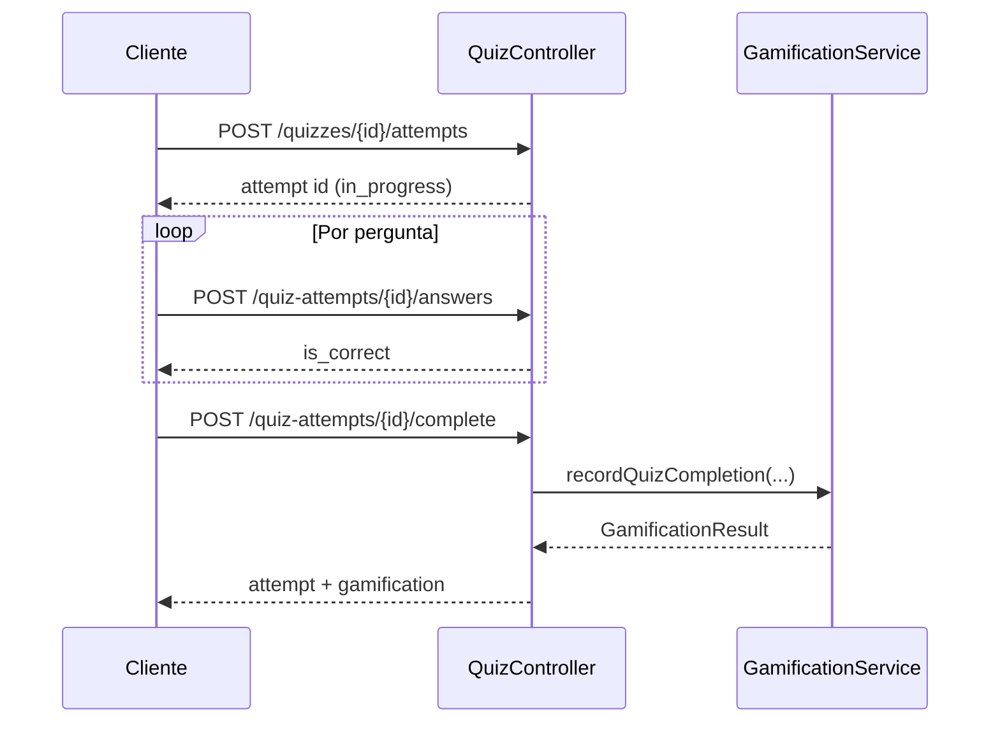

# API — Quizzes e tentativas

**Versão:** 1.0.0 (Sprint 3 — fluxo de tentativa + gamificação)  
**Base URL:** `http://127.0.0.1:8000/api`  
**Autenticação:** Bearer Token (endpoints abaixo)

---

## Visão geral

| Estado | Endpoints |
|--------|-----------|
| ✅ Implementado | listar, detalhe, perguntas, iniciar tentativa, responder, concluir, histórico próprio |
| ⏳ 501 / parcial | CRUD admin/professor (`POST/PATCH/DELETE /quizzes`) |

A **gamificação** na conclusão é feita exclusivamente por `GamificationService::recordQuizCompletion()` — ver [Gamificação](./gamification.md).

O **AccessGate** em quizzes (filtrar por `access_level_id`) está planeado para sprint posterior; nesta fase as rotas de leitura não aplicam gate ao quiz em si.

---

## Endpoints

| Método | Endpoint | Auth | Descrição |
|--------|----------|------|-----------|
| GET | `/quizzes` | Sim | Lista (últimos 20) |
| GET | `/quizzes/{id}` | Sim | Detalhe do quiz |
| GET | `/quizzes/{id}/questions` | Sim | Perguntas (sem opções expostas separadamente na listagem de perguntas) |
| POST | `/quizzes/{id}/attempts` | Sim | Iniciar tentativa |
| GET | `/quiz-attempts/{id}` | Sim | Detalhe da tentativa (própria) |
| POST | `/quiz-attempts/{id}/answers` | Sim | Registar resposta |
| POST | `/quiz-attempts/{id}/complete` | Sim | Concluir e disparar gamificação |
| GET | `/me/quiz-attempts` | Sim | Últimas 20 tentativas do utilizador |
| POST | `/quizzes` | Admin/Professor | Criar — 501 |
| PATCH | `/quizzes/{id}` | Admin/Professor | Actualizar — 501 |
| DELETE | `/quizzes/{id}` | Admin/Professor | Remover — 501 |

---

## Fluxo completo (cliente)



---

## POST /quizzes/{id}/attempts

Inicia tentativa com `status: in_progress`.

**Resposta 201:**

```json
{
  "message": "Attempt started.",
  "id": "attempt-uuid"
}
```

---

## POST /quiz-attempts/{id}/answers

Regista ou actualiza a resposta a uma pergunta (única por `attempt_id` + `question_id`).

**Body:**

```json
{
  "question_id": "uuid",
  "selected_option_id": "uuid",
  "time_spent_secs": 45
}
```

**Validações:**

- Tentativa pertence ao utilizador autenticado.
- `status` deve ser `in_progress`.
- Pergunta pertence ao quiz da tentativa.
- Opção pertence à pergunta.

**Resposta 200:**

```json
{
  "message": "Answer recorded.",
  "is_correct": true
}
```

**Erros:** 404 (tentativa), 409 (já concluída), 422 (pergunta/opção inválida).

> **Nota de segurança:** `is_correct` é devolvido para feedback imediato na UI. Em produção pode omitir-se até `complete` conforme política pedagógica.

---

## POST /quiz-attempts/{id}/complete

Calcula pontuação da tentativa, marca como `completed` e chama gamificação.

**Body opcional:**

```json
{
  "time_spent_secs": 400
}
```

Se omitido, usa a soma de `time_spent_secs` das respostas registadas.

**Cálculo no controlador (não é gamificação):**

- `score` = percentagem de respostas correctas (0–100).
- `correct_answers`, `total_questions`, `performance_rating` (`excellent` ≥90, `good` ≥70, `fair` ≥50, `needs_improvement` caso contrário).

**Resposta 200:**

```json
{
  "message": "Attempt completed.",
  "data": {
    "id": "attempt-uuid",
    "quiz_id": "quiz-uuid",
    "user_id": "user-uuid",
    "status": "completed",
    "score": 100,
    "correct_answers": 5,
    "total_questions": 5,
    "time_spent_secs": 400,
    "points_earned": 100,
    "bonus_points": 20,
    "performance_rating": "excellent",
    "started_at": "...",
    "completed_at": "..."
  },
  "gamification": {
    "points_delta": 120,
    "total_points": 120,
    "current_level": 2,
    "level_changed": true,
    "previous_level": 1,
    "transactions": [ ... ],
    "badges_earned": [ ... ]
  }
}
```

**Erros:** 404, 409 (não está `in_progress`).

### Pontos atribuídos (serviço)

Ver tabela em [gamification.md](./gamification.md#fluxo-com-quiz). Exemplo com `base_points = 100`, 100% correctas, sem bónus de velocidade:

- `quiz_completion`: 100
- `quiz_bonus_accuracy`: 20 (≥80%)
- Total `points_delta`: 120 → nível 2 (≥101 pontos)

---

## GET /quiz-attempts/{id}

Apenas o dono da tentativa. **404** se não existir ou não for do utilizador.

---

## GET /me/quiz-attempts

Últimas 20 tentativas do utilizador, `started_at` desc.

---

## GET /quizzes e GET /quizzes/{id}

Dados directos da tabela `quizzes` (inclui `base_points`, `time_limit_secs`, `access_level_id`, estatísticas agregadas).

---

## GET /quizzes/{id}/questions

Lista `quiz_questions` ordenadas por `question_order`. As opções de resposta estão em `quiz_options` (ligação por `question_id`); o endpoint actual devolve apenas perguntas — o cliente pode precisar de endpoint dedicado a opções numa sprint futura.

---

## Modelo de dados (resumo)

**quiz_attempts:** `status` (`in_progress` | `completed`), `score`, `points_earned`, `bonus_points`, `performance_rating`, timestamps.

**quiz_attempt_answers:** uma linha por pergunta; `is_correct` calculado ao gravar com base em `quiz_options.is_correct`.

---

## Testes

`tests/Feature/QuizGamificationTest.php` — registo, tentativa, resposta correcta, complete, verificação de transacções, nível e badge *First Steps*.

**Última actualização:** 4 de junho de 2026
